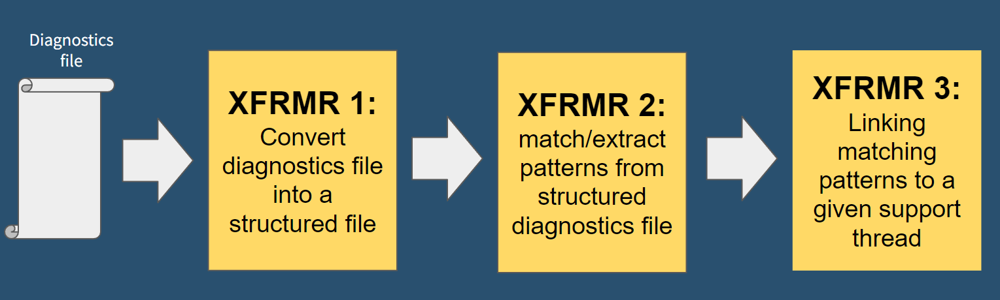
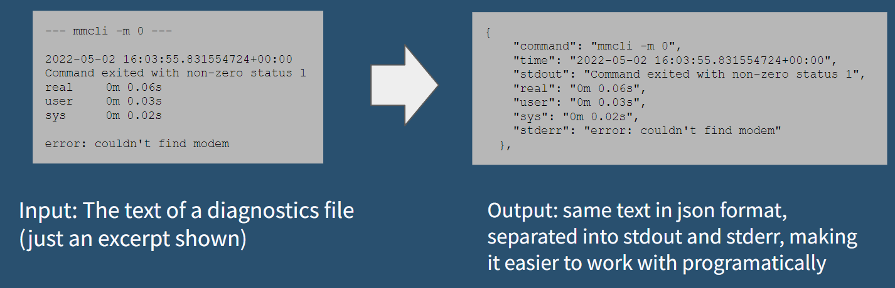
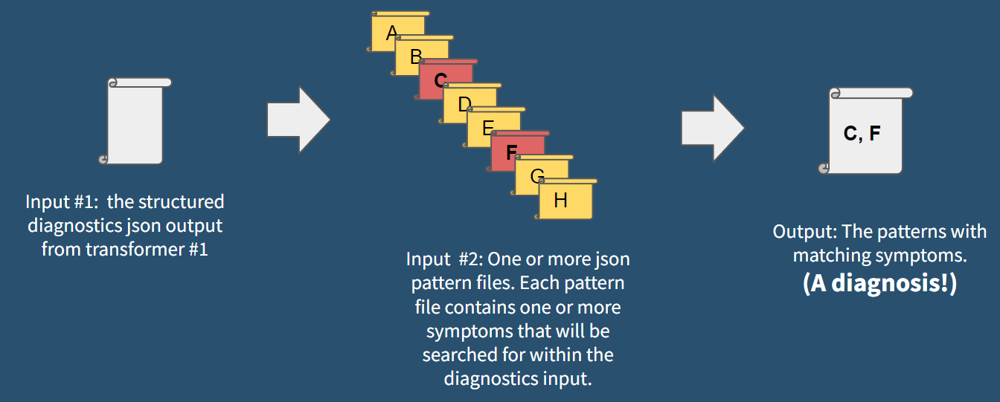
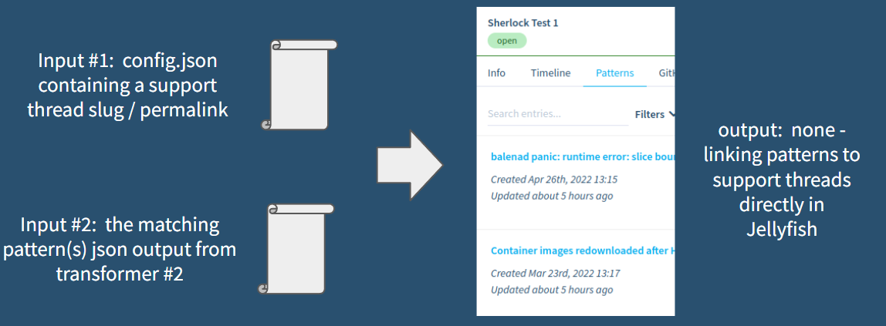

  
   
  <h1>Sherlock Pattern Initiative</h1>

Umbrella for different diagnostics, symptoms and pattern transformers

# Sherlock Pattern Process

The process consists of three transformers that essentially take a balena device diagnostics file as an input, match it to a set of pattern files that contain symptoms, and then attach the detected patterns to a given thread in Jellyfish. 

## Logfile / Diagnostics translation
The diagnostics-to-json transformer translates device diagnostics output or logfiles into structured diagnostics JSON files:

## Matching / Checking Symptoms for patterns

The diagnostics-json-to-patterns-json symptom parser matches symptom rules (regex, regexmatch, ...) according to [formulajs](https://github.com/formulajs/formulajs) by utilisting the [jellyscript](https://github.com/product-os/jellyfish-jellyscript) parser.

The "symptom rules" are contained in "pattern files" that reside in the input folder for this transformer. When a diagnostics json file is fed into the parser, it attempts to match the set of symptoms in each pattern file. If all symptom combinations for the pattern are met (multiple symptoms can be matched using and, or, not) then the pattern is considered to be detected in the inputted diagnostics file.

## Pattern Json to jellyfish updater

This transformer takes the output of transformer #2 (a json file containing patterns that were matched to symptoms in a diagnostics file) along with a support thread slug/permalink in a config.json file as inputs. It then attaches the patterns to the given support thread.

